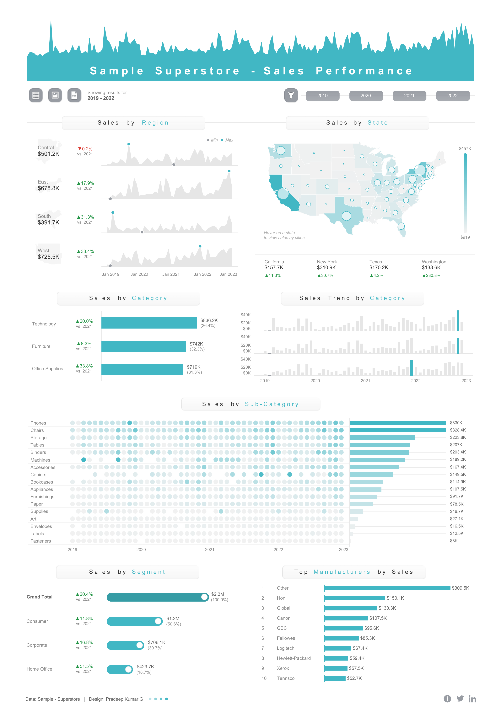
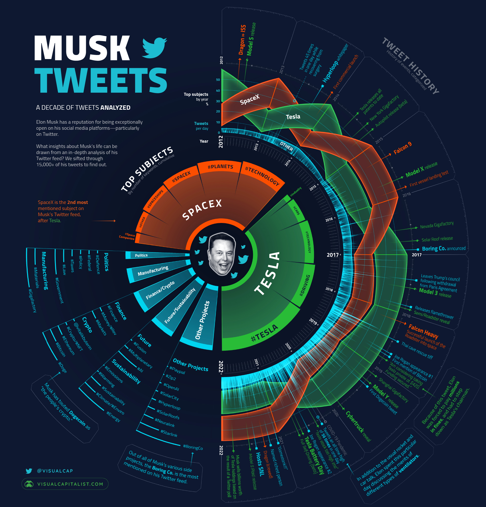

# Visualisation analysis & design

Critique of three published data visualisations using the Munzner *what / why / how* framework, plus a design proposal for a multidimensional dance dataset that became the basis of the [Dance analytics dashboard](../dance-analytics-dashboard/) project.

Reference: Tamara Munzner, *Visualization Analysis and Design* (CRC Press, 2014).

---

## Part A — Critiques

### A.1 "Happy People, Happy Planet?" — Li & Mendoza (2023)

**Encoding**

- *Geographic bubble map* — country position (lat/lon), bubble size encodes population, colour hue encodes a derived sustainability category (green = happy + low footprint, blue = moderate, red = unhappy + high footprint), with redundant emoji glyphs reinforcing the category.
- *Main scatter plot* — happiness (0–8) on Y, ecological footprint on X, shape distinguishes developed vs developing nations, callouts label exceptional countries (Costa Rica, Mexico, Panama).
- *Small multiples* — 2011 / 2014 / 2017 / 2020 with a consistent encoding to enable temporal comparison.

**Data**

| Attribute | Type |
|-----------|------|
| Country | categorical, nominal |
| Year (2011, 2014, 2017, 2020) | ordinal |
| Happiness score (0–8) | quantitative |
| Ecological footprint (gha / capita) | quantitative |
| Population | quantitative |
| Development status | binary categorical |
| Lat / Lon | quantitative spatial |
| Sustainability category | derived (3 levels) |

**Tasks supported**

- Find correlations between happiness and footprint
- Identify extremes (e.g. Costa Rica)
- Compare developed vs developing distributions
- Track temporal change via small multiples

**Strengths**

- Aligned-position scatter plot supports accurate quantitative comparison.
- Small multiples expose temporal pattern clearly.
- Multi-view coordination (map + scatter + facets) gives spatial, analytical and temporal angles.

**Weaknesses**

- Population-by-bubble-area is hard to compare; circles are weaker than bars/lines.
- Bubble-size legend missing.
- Dense regions like Europe become illegible.
- Compressed small multiples make labels and exact values hard to read.

---

### A.2 "Sample Superstore — Sales Performance" Dashboard — Kumar (2024)

**Encoding**

- Stacked area charts — Y = sales value, X = month-level time.
- Point marks for min/max trend values.
- Choropleth map — colour saturation = sales intensity, bubble size = sales, state boundaries = location.
- Horizontal bar charts for category sales with colour-coded percent change.
- Grouped bar charts for trends over time by category.
- Bubble matrix — horizontal bar for totals, colour saturation for magnitude, visibility encoding for sub-category sales.

**Data** — multidimensional table over time (months/years 2019–2023), state/region, category/sub-category, sales revenue, derived YoY change, geographic coordinates.

**Tasks supported**

- Identify sales trends (growth, seasonality)
- Evaluate performance by area / category / sub-category
- Identify extremes (e.g. California)
- Look up exact values via annotation
- Explore geographic patterns
- Track KPIs for executive decisions

**Strengths**

- Aligned bar / area charts give accurate quantitative comparison.
- Areas + small multiples + grouped bars together support time-series analysis well.
- Variety of idioms covers exploration, observation and decision-making needs.

**Weaknesses**

- Colour inconsistency across panels weakens visual links.
- Dense bubble matrix rows are hard to compare.
- In stacked areas, only the bottom series has a true baseline.
- Multi-view linking between related panels could be sharper.

---

### A.3 "Musk Tweets" — VisualCapitalist (2022)

**Encoding**

- Radial spiral timeline — angular position spirals from centre outward to encode time.
- Bars extending radially encode tweet frequency.
- Hue separates themes (SpaceX = orange, Tesla = green, "Other Projects" = blue, plus subcategories).
- Inner sunburst — bar length for frequency, angular position for category by year.
- Sidebar — sub-category bar length and topic hierarchy.
- Text annotations call out events (e.g. Model 3 release).

**Data** — ~15,000 tweets; timestamp (daily/weekly, 2012–2022), subject (categorical), event labels, tweet count, topic proportion, annual aggregates.

**Tasks supported**

- Track temporal trends in topics and behaviour
- Compare yearly topic dominance
- Spot peaks and link them to real-world events
- Locate specific timeframes via annotations

**Strengths**

- Memorable, visually appealing infographic.
- Strong narrative flow; well suited to public engagement.
- Works for advocacy and storytelling.

**Weaknesses**

- Radial encoding conflates year and tweet volume.
- No scales — exact tweet counts are unreadable.
- Overlapping annotation text reduces legibility.
- A standard line / bar chart would serve trend analysis far better.
- Not appropriate for tasks requiring precise numerical comparison.

---

## Part B — Visualisation design for a dance dataset

A design proposal for a multidimensional dance dataset that ultimately became the [Dance analytics dashboard](../dance-analytics-dashboard/).

### B.1 Data and dataset types

| Group | Examples | Type |
|-------|----------|------|
| Categorical | Dance Type, Dance Style, Origin, Instrumental, Dance Formation, Costume, Famous Practitioners, Associated Music Genre, Events, Festivals, Adaptation, Age Group | nominal |
| Ordinal | Learning Difficulty, Cultural Significance, Time Period, Hardness Ratio (when ranked) | ordered |
| Quantitative | Hardness Ratio, Tempo (BPM) | continuous |
| Text / descriptive | Notable Characteristics, Health Benefits, Modern Adaptations | free text |

- Categorical fields enable grouping and comparison.
- Quantitative and ordinal fields support ranking and trend detection.
- Text fields are summarised or recoded into categories to add context without clutter.

### B.2 Visualisation tasks

- **Comparison** — which dance forms / regions / periods dominate.
- **Correlation** — does learning difficulty track tempo or health benefits?
- **Distribution** — how costumes, ages, styles, and formations spread across time / space.
- **Trend analysis** — origins and modernisation of styles.
- **Summarisation** — health benefits or famous dancers grouped by style or country.
- **Describe** — narrative around diversity and evolution.
- **Explore** — connections, patterns, outliers.

### B.3 Chart support

| Chart | Use |
|-------|-----|
| Bar chart | Compare costumes, dance styles, regions |
| Scatter plot | Hardness vs tempo; identify outliers |
| Bubble map / choropleth | Geographic origins and global spread |
| Heatmap / matrix | Style ↔ benefit / characteristic association |
| Gantt / timeline | History and evolution over time |

### B.4 Purpose

- Primarily exploratory — let the user find trends and ask questions.
- Some charts also explain key findings.
- Encodings rely on position and colour for accuracy and accessibility.
- Colour palettes are picked for accessibility.
- Redundant labels and annotations are added only where useful, never decorative.

### B.5 Conclusion

A coordinated set of bar charts, scatters, maps, heatmaps and timelines makes the dataset substantially easier to read than any single chart. Each chart targets a specific pattern (rank, correlation, geography, association, evolution), and together they help a non-expert audience explore both the diversity and the evolution of dance.

---

## References

1. Tamara Munzner. *Visualization Analysis and Design.* A K Peters / CRC Press, 2014.
2. Overleaf. https://www.overleaf.com
